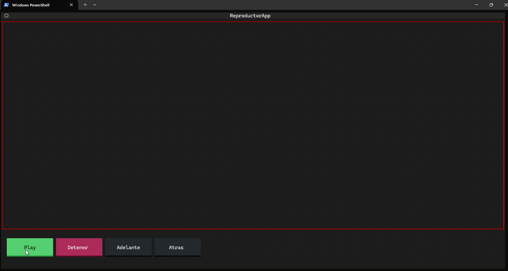

# Reproductor de animaciones ASCII

Este es un reproductor de animaciones ASCII basado en la biblioteca [Textual](https://textual.textualize.io/).

Reproduce una animación de texto, la pausa, la detiene. Ver la sección de próximas funcionalidades.

El formato de los archivos que contienen las animaciones contiene una primera línea de configuración de la animación:

```
VELOCIDAD=0.05;REPETIR=SI
```
VELOCIDAD indica la duración en segundos de transición entre frames.
REPETIR indica si se debe repetir la animación una vez que llega al final. 


Luego, cada cuadro o frame de la animación está separado por la siguiente marca:

```
[frame!]
```



## Próximas funcionalidades

1. ~~Adelantar y retroceder~~
2. ~~Reproducir a diferentes velocidades 2x, 1.5x, 0.5x~~
3. ~~Selector de archivos para reproducir~~
4. Soporte para animaciones en color
5. Lista de reproducción
6. Barra de progreso + avanzar hasta un punto con el mouse.
7. ~~Invertir dirección de reproducción~~